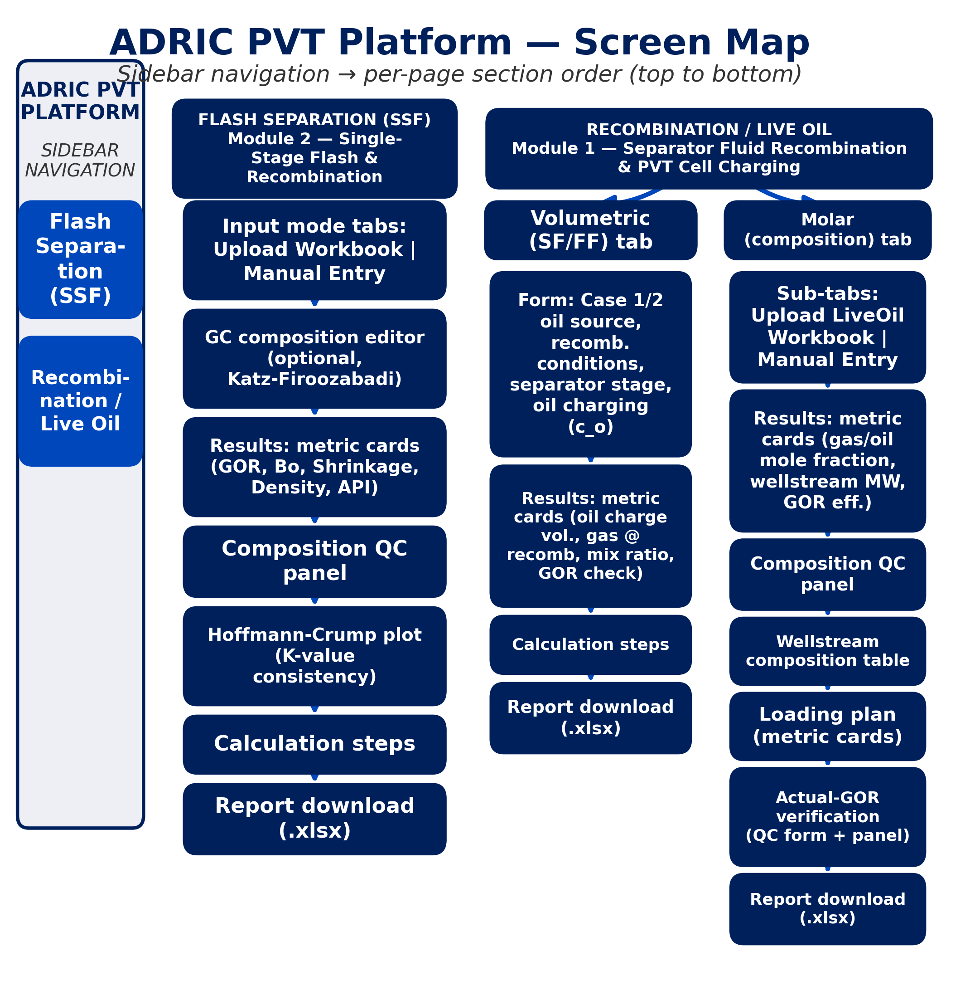
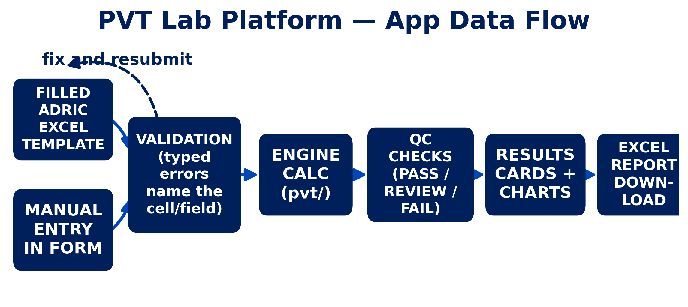
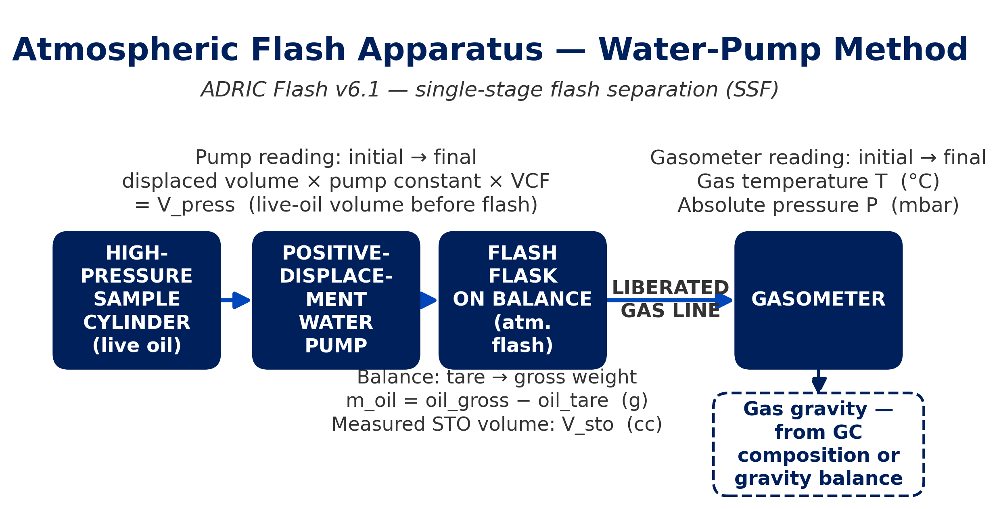

# The Application Guide

This chapter is the one to read at the bench, laptop open next to the
notebook: what screen to open, which box on that screen each of your
readings goes into, what unit it wants, and what the result on the other
side is telling you. The equations behind every number here are written out
in full in Chapters 5 (Flash Separation) and 6 (Recombination); this chapter
does not repeat them, it tells you where to type what.

## Starting the app

The platform is a two-page Streamlit web app. From the repository root:

```bash
streamlit run app.py
```

This opens a browser tab with a navigation sidebar carrying two pages:
**Flash Separation (SSF)** and **Recombination / Live Oil**. Both pages run
against the same calculation engine, so the same input always produces the
same answer whether you reach it by typing into the form or by uploading a
filled ADRIC workbook. Nothing needs to be started separately; the app has
no database and no login, everything lives for the length of the browser
session.

{width=100%}
*Figure 3.1 - The two pages, and the shared building blocks (page header, metric cards, QC pills, calc-steps expander, report download) every screen in the app is assembled from.*

## How your data flows

Every screen in the app follows the same shape, whichever page you're on:
you either **type readings into a form** or **upload a filled ADRIC
workbook**; whichever one you last submitted successfully becomes the
"active" result and is what the metric cards, QC pills, and report download
below render. Submitting a bad form, or attaching a workbook the app can't
read, does not overwrite a good result that's already on screen — but it
does clear it, deliberately, so a stale answer can never be mistaken for the
answer to what's currently in the boxes. Fix the listed problem and submit
again to get a fresh result.

{width=100%}
*Figure 3.2 - One flow, two entry points: manual form or workbook upload, both landing on the same validated result and the same downstream rendering.*

## The Flash Separation page

Module 2 of the platform: the single-stage atmospheric flash test, water-pump
method. This is the test that takes a live-oil sample down to stock-tank
conditions and measures what comes off as gas and what's left as oil.

{width=100%}
*Figure 3.3 - The three instrument readings the Manual Entry form is built around: pump, stock-tank flask/balance, gasometer.*

The page opens on two tabs, **Upload Workbook** and **Manual Entry**. Either
one gets you to the same results area below; use whichever matches how the
data already exists (a filled workbook from the bench, or numbers still in
your notebook).

### Manual Entry, field by field

The form mirrors the ADRIC Flash v6.1 `Volumetrics_Master` sheet's 13 input
fields exactly, three per row, exactly in this order:

| Field (exact label) | In plain terms | Where you get it on the bench | Units | Allowed range | SA-372 example |
|---|---|---|---|---|---|
| Initial pump reading | The water-displacement pump's counter before you started pushing the live sample through | Read off the pump's own dial/counter before the transfer | cc | ≥ 0 | 50.0 |
| Final pump reading | The same pump's counter after the transfer is done | Read off the pump's dial/counter after the transfer | cc | must be greater than the initial reading | 70.8945 |
| Stock tank oil volume (V_sto) | How much stock-tank oil actually came out | Read off the graduated stock-tank flask directly — this is a measurement, not something the app works out for you | cc | > 0 | 15.7576 |
| Oil tare weight | The empty flask's own weight | Weigh the flask empty, before catching any oil in it | g | ≥ 0 | 100.0 |
| Final oil + tare weight | The flask's weight with the flashed oil in it | Weigh the flask again after the flash, oil still in it | g | must be greater than the tare weight | 113.71 |
| Initial gasometer reading | The gas meter's counter before the flash | Read off the gasometer (water-displacement gas meter) before the flash | cc | ≥ 0 | 500.0 |
| Final gasometer reading | The gas meter's counter after the flash | Read off the gasometer after the flash | cc | must be ≥ the initial reading | 1458.2037 |
| Gas temperature | Room/gasometer temperature while the gas volume was read | Thermometer at the gasometer | °C | strictly between -10 and 60 | 20.0 |
| Measured gas abs. pressure | The absolute pressure in the gasometer drum at the time of reading | Barometer or manometer at the gasometer, absolute (not gauge) | mbar | strictly between 500 and 1500 | 1012.25 |
| Gas gravity (Air=1) | How heavy the flash gas is relative to air | From the lab's gas-gravity balance (measured separately, not derived from anything else on this form) | dimensionless | strictly between 0.5 and 3.0 | 1.146 |
| Pump constant | The pump's own calibration factor | Off the pump's calibration certificate/label | dimensionless | > 0 | 1.0 |
| Volume correction factor (VCF) | A second pump calibration correction | Off the pump's calibration sheet | dimensionless | > 0 | 1.0 |
| Gasometer factor | The gasometer's own calibration factor | Off the gasometer's calibration certificate | dimensionless | > 0 | 1.0 |

If you leave the pump/VCF/gasometer factors alone, they default to 1.0
(no correction applied) — only change them if your instrument's own
calibration sheet says otherwise. The three fields with an explicit numeric
band (temperature, pressure, gas gravity) are *strict* inequalities: typing
exactly 60.0°C, for instance, is rejected. The number-input boxes are
pre-tightened by 0.01 at those edges so you can't even type the excluded
boundary value; every other field's floor is a plain "can't be negative" (or
"can't be zero" where the calculation would divide by it).

Clicking **Calculate** validates all 13 values in one pass. If anything is
wrong, every violated rule is listed at once (not just the first one you'd
hit) — for example, submitting a final pump reading lower than the initial
one gives "pump_final_cc must be greater than pump_initial_cc", right next
to any other problems on the same submission.

### The composition editor

Below the 13 volumetrics fields sits an optional table: one row for every
one of the 52 Katz-Firoozabadi GC component codes (H2, H2S, CO2, N2, C1, C2,
C3, ... up through the C36+ cut), with four blank columns — **Gas Mol%**,
**Gas Wt%**, **Oil Mol%**, **Oil Wt%**. This is where you transcribe the GC
lab's compositional analysis of the flashed gas and the flashed oil, mol%
and wt% bases for each stream.

Composition is genuinely optional: **leave a cell at zero to skip it**. A
stream (gas or oil) is only built at all once at least one of its two
columns has a non-zero entry somewhere; with nothing entered for the gas
side, the app quietly skips everything downstream that needs gas
composition (QC pills, the Hoffmann plot, the mass-recombination report) and
just shows you the 12 flash-volumetrics results. A cell you clear entirely
(blank) is treated as "not measured for this component," exactly like a
zero — it does not corrupt the sums. A **negative** number, on the other
hand, is rejected outright: submitting one blocks Calculate with an error
naming the exact component and column, e.g. "Composition editor (C5):
negative Gas Mol% value -3.0".

### Uploading a workbook instead

On the **Upload Workbook** tab, attach a filled
`ADRIC_Flash_Separation_Calc_v6.1.xlsx`. The app reads the
`Volumetrics_Master` sheet only (the same 13 fields as the manual form, plus
sample metadata and the full 52-row GC composition block) — the workbook's
other sheets are downstream/computed and are not read.

If the file isn't the right template, or a required cell is empty, or a
composition cell is negative, the upload is rejected with a plain-language
error banner rather than silently reading garbage — see "Common problems"
below for what those messages actually look like. A successful upload shows
a green "Loaded &lt;sample ID&gt;" confirmation and populates the same
results area the manual form does.

### Reading the results

Once you have a valid result (either route), five metric cards appear:

- **GOR** — gas-oil ratio, scf of gas per barrel of stock-tank oil: how much
  gas came off relative to how much oil was left.
- **Bo** — flash formation volume factor: how many cc of live oil at charge
  pressure it took to produce one cc of stock-tank oil (this is always ≥ 1;
  the oil shrinks as it flashes).
- **Shrinkage** — the reciprocal of Bo: what fraction of the original live
  volume survived as stock-tank oil.
- **Oil Density** — the stock-tank oil's density at 60°F, g/cc, computed
  directly from the flask's measured mass and volume.
- **API Gravity** — the same density, expressed on the API scale everyone in
  the industry actually talks in.

### Composition QC

When both a gas and an oil stream are present (uploaded, or built from the
composition editor), a **Composition QC** block appears with one pill per
check: the gas mol% sum, gas wt% sum, oil mol% sum, and oil wt% sum each
against 100, plus a mol%-vs-wt%-derived molecular weight consistency check
for each stream. Every check runs independently — a manual-entry
composition with mol% only and no wt% at all skips only the wt%-dependent
checks (a small caption explains why), it doesn't take the rest of the panel
down with it.

**What the pills mean.** Each pill is a colored dot plus the check name plus
a plain-language message:

- **PASS (green)** — the value is inside the accepted band. Nothing to do.
- **REVIEW (amber)** — borderline. Worth a second look at the underlying GC
  sheet or transcription before you treat the result as final, but it's not
  necessarily wrong.
- **FAIL (red)** — outside the accepted band. Usually means a transcription
  error, a unit mixup (mol% typed into a wt% column, or vice versa), or a
  genuinely bad GC run. Don't report the result until this is resolved —
  re-check the source composition sheet, fix the offending cell, and
  re-submit.

The house tolerance bands behind those colors:

| Check | What it's grading | PASS up to | REVIEW up to | Beyond that |
|---|---|---|---|---|
| Composition sum (mol% and wt%, gas and oil — 4 pills) | How far the raw composition sum is from 100 | 0.5 points off | 2.0 points off | FAIL |
| MW consistency (gas, oil — 2 pills) | How far the mol%-derived molecular weight is from the wt%-derived one | 5% | 10% | FAIL |
| Hoffmann-Crump R² | How well the gas/oil K-values fit one straight line | R² ≥ 0.98 | R² ≥ 0.95 | FAIL |

### The Hoffmann plot

Below the composition QC pills, a **Hoffmann-Crump K-value Consistency**
crossplot appears (needs at least two GC components present, with a
positive value, in *both* the gas and oil streams — with fewer, the app
shows a plain warning and skips the plot rather than crashing). In two
sentences: every qualifying component should land its point on (or very
close to) one straight line; a badly scattered set of points is the plot
telling you the gas and oil analyses don't actually belong to the same
equilibrium — a swapped bottle, a mistimed sample, or a transcription error
between the two GC sheets is the usual explanation.

### Calculation steps

A collapsed **Calculation Steps** expander sits below the metric cards —
click it open to see every intermediate number the engine worked through
(pump volume, oil mass, gas volume at standard conditions, and on to GOR and
Bo) with your actual submitted values plugged in, not just the formulas.
Useful for tracing a result back to a specific reading when something looks
off.

### Report download

Once both the oil and gas GC compositions are available (either route), a
**Download Excel Report** button appears, producing an ADRIC-styled `.xlsx`
with the flash results, the whole-sample mass-recombination numbers, and a
QC summary table, all in one sheet. The filename is automatically prefixed
with the sample ID so reports for different samples never overwrite each
other in a downloads folder. With volumetrics only (no composition entered
or uploaded), the metric cards and calc-steps still work, but the app shows
an info banner asking for composition before the report download appears —
there's no whole-sample number to report without it.

## The Recombination page

Module 1 of the platform: preparing a live (recombined) fluid sample for PVT
cell testing. Two tabs, **Volumetric (SF/FF)** and **Molar (composition)**,
covering the two different ways the lab actually approaches this problem.

{width=100%}
*Figure 3.4 - What "recombination" means at the bench: separator (or stock-tank) oil and gas cylinder gas, metered together to reproduce the reservoir GOR.*

### Volumetric (SF/FF) tab

Use this tab when you have a **measured separator-stage GOR** and a
**shrinkage factor**, and you're either charging the separator oil itself or
the fully-degassed stock-tank oil. It implements the Carlsen & Whitson
multi-stage recombination method (single separator stage, in this UI).

The first choice on the form is **oil source**, a two-way radio:

- **Case 1 — Separator Oil + Separator Gas.** You charge oil taken directly
  from the separator. The shrinkage factor (SF) is what converts that
  separator-oil volume to its stock-tank equivalent for the gas
  calculation. There's no flash gas term here (FF is ignored).
- **Case 2 — Stock Tank Oil + Separator Gas.** You charge fully-degassed
  stock-tank oil instead. Because that oil has already lost its solution
  gas, the Flash Factor (FF) makes up for it — it's the gas that *would*
  have come off the separator oil on its way to stock-tank conditions, and
  by lab-practice convention all of it, along with the separator-stage gas,
  gets loaded from the same gas cylinder.

Every field on the form, and where it comes from:

| Field (exact label) | In plain terms | Where you get it on the bench | Units | Allowed range | Notes |
|---|---|---|---|---|---|
| Oil source | Case 1 or Case 2 (see above) | Decided by which oil you're actually charging | choice | — | Determines whether SF or FF is used |
| Live Fluid Volume | The target volume of recombined live fluid you want to end up with | The PVT cell/cylinder's target charge volume | cc | ≥ 1.0 | Drives the whole calculation — oil and gas volumes are apportioned to hit this exactly |
| Shrinkage Factor SF (V_STO/V_sep_oil) | How much the separator oil shrinks on its way to stock-tank conditions | From a prior flash test on the separator oil, or a lab reference value | dimensionless | (0, 1.0], typical 0.65-0.99 | Only used for Case 1; required to be in range whenever Case 1 is selected |
| Flash Factor FF (scf/STB STO) | Solution gas the stock-tank oil would release if it were flashed from separator conditions | From a prior flash/lab reference on the same oil | scf/STB | ≥ 0 | Only used for Case 2 |
| Recombination Pressure | The pressure you're recombining the fluid at | Your target PVT cell pressure | psia | > 0 | |
| Recombination Temperature | The temperature you're recombining at | Your target PVT cell temperature | °F | — | Sanity-checked only (rejects wildly unrealistic values, no explicit upper bound) |
| Recombination Z-factor | Gas compressibility factor at recombination conditions | From a correlation or lab measurement at recombination P/T | dimensionless | (0, 2.0] | |
| GOR (separator stage) | The measured separator GOR | Separator-stage gas and oil meters | scf/STB | > 0 | |
| Pressure (separator stage) | Separator operating pressure | Separator gauge | psia | > 0 | |
| Temperature (separator stage) | Separator operating temperature | Separator thermometer | °F | — | Same sanity check as recombination temperature |
| Z-factor (separator stage) | Gas compressibility factor at separator conditions | Correlation or lab measurement at separator P/T | dimensionless | (0, 2.0] | |
| Oil Charging Pressure | The pressure the oil is actually metered into the cylinder at | Your charging-pump gauge (defaults to 14.7 psia, i.e. atmospheric) | psia | > 0 | Feeds the compressibility correction below |
| Compressibility model | Constant, or a pressure-dependent polynomial | Whichever your oil compressibility data supports | choice | — | Only the selected model's fields are used |
| c_o constant | A single oil compressibility value | Lab PVT data or a correlation, if using the constant model | 1/psia | ≥ 0 | Ignored unless "Constant" is selected |
| a0, a1, a2, a3 | Polynomial coefficients for c_o(P) = a0 + a1·P + a2·P² + a3·P³ | Regressed from lab compressibility-vs-pressure data, if using the polynomial model | 1/psia, 1/psia², ... | — | Ignored unless "Polynomial" is selected |

Clicking **Calculate** validates the whole set at once (stage GOR/pressure/Z
in range, live volume positive, SF in range for Case 1, FF non-negative for
Case 2, and so on) and lists every problem found, not just the first.

**What comes back.** Four metric cards: **Oil Charge Volume** (cc of oil to
actually load, at your charging pressure), **Total Gas @ Recomb** (cc of gas
at recombination conditions), **Cylinder Mix Ratio** (cc gas per cc oil, at
recombination conditions), and **GOR (check)** (the total GOR
back-calculated from the gas actually placed in the cell, for you to compare
against your input GOR as a sanity check). A calc-steps expander walks
through the intermediate numbers, and a report download button builds an
`.xlsx` with the full setup, recombination conditions, charge volumes, and
GOR verification. There is no QC panel on this tab — there's no composition
data here to grade; the GOR check is the self-consistency signal this route
offers.

*(The form's own default values — 300 cc live fluid, SF 1.0, separator GOR
850 scf/STB at 815 psia/145°F/Z=0.855, recombining at 5014.7 psia/200°F/
Z=0.82 — are a generic illustrative example, not a measured SA-372 result;
unlike the Molar tab below, this route has no SA-372 golden reference in the
platform's own test suite.)*

### Molar (composition) tab

Use this tab when you have a **lab GOR** plus stock-tank-oil density/MW and
gas MW (or full GC compositions for both), and you want the recombined
fluid's actual **composition**, not just charge volumes — this is the
ADRIC LiveOil v4.1 `Recombination` sheet's own method. It has its own
**Upload LiveOil Workbook** and **Manual Entry** sub-tabs.

**GOR and basis.** The first three fields are GOR (scf/STB), a
**Separator/Stock Tank basis** choice, and the Shrinkage Factor. Which basis
you pick matters: a separator-basis GOR is divided by the shrinkage factor
to put it on a stock-tank footing before anything else happens; a
stock-tank-basis GOR is used exactly as typed. **Be aware of an open
engineering question here (ledger entry D-018):** the direction that
division should go, for the separator-basis case, is under engineering
review — the source LiveOil v4.1 workbook's own formula divides on the
*opposite* branch from what this app currently does. With a Shrinkage
Factor of exactly 1.0 the two conventions give an identical answer (dividing
or not dividing by 1.0 makes no difference), which is why the SA-372
reference numbers in this manual are unaffected either way. If your
shrinkage factor is not 1.0 and you're using the Separator basis, treat the
result as one to sanity-check by hand until that ruling lands.

Every manual-entry field, and where it comes from:

| Field (exact label) | In plain terms | Where you get it on the bench | Units | Allowed range | SA-372 example |
|---|---|---|---|---|---|
| GOR (scf/STB) | The lab-measured gas-oil ratio to recombine to | From the flash/separator test on this sample | scf/STB | ≥ 0 | 339.0 |
| GOR basis | Separator or Stock Tank (see above) | Which test the GOR figure above actually came from | choice | — | Stock Tank |
| Shrinkage Factor | Same SF as the Volumetric tab | Prior flash test or lab reference | dimensionless | (0.01, 1.0] | 1.0 |
| STO Density @60F | Stock-tank oil density at standard conditions | Pycnometer or densitometer reading on the stock-tank oil | g/cc | > 0 | 0.8196 |
| STO MW | Stock-tank oil molecular weight | From the GC compositional analysis (computed from the STO mol% composition), or a lab-reported value | g/mol | > 0 | 187.05 |
| Gas MW | Recombination gas molecular weight | From the GC compositional analysis of the gas, or a lab-reported value | g/mol | > 0 | 26.10 |
| Z at Standard Conditions | Gas compressibility factor at standard conditions | Usually left at the lab default unless you have a better value | dimensionless | (0.01, 2.0] | 0.99 |

Both **STO density/MW and gas MW can come from full GC compositions
instead of typed numbers** — that's what the **Upload LiveOil Workbook**
sub-tab is for: attach a filled `ADRIC_LiveOil_Preparation_Calc_v4.1.xlsx`
and the app reads the recombination GOR/basis/shrinkage/Z inputs, the full
51-row STO and gas compositions (mol% only — the workbook's wt% input
column is not read), and the cylinder-loading inputs below, all five
required sheets at once. A **Wellstream Composition** table (each
component's mol% in the recombined fluid, light ends first) only appears on
the upload path, since manual entry never collects a full composition.
Manual entry only ever grades composition QC (and shows the wellstream
table) when you've used the upload path — the two `sto_stream`/`gas_stream`
slots stay empty for a typed-in entry.

**Cylinder Loading** — the second block of fields, present on both upload
and manual entry (manual entry always needs these, since there's no
workbook to pull them from):

| Field (exact label) | In plain terms | Where you get it on the bench | Units | Allowed range | SA-372 example |
|---|---|---|---|---|---|
| Cylinder Volume | The transfer cylinder's internal volume | Off the cylinder's own spec/calibration | cc | ≥ 1.0 | 1000.0 |
| Target Oil Volume | How much stock-tank oil you intend to charge | Your loading-plan target | cc | > 0 | 150.0 |
| Oil Load Pressure | Gauge pressure the oil cylinder is at while loading | Oil-cylinder gauge | psig | — | 2000.0 |
| Oil Load Temperature | Temperature the oil cylinder is at while loading | Thermometer at the oil cylinder | °F | — | 75.0 |
| Gas Load Pressure | Gauge pressure the gas is metered in at | Gas-cylinder gauge | psig | — | 5000.0 |
| Gas Load Temperature | Temperature at the gas cylinder while loading | Thermometer at the gas cylinder | °F | — | 75.0 |
| Z at Gas Load | Gas compressibility factor at the gas-load pressure/temperature | Correlation or lab value at those conditions | dimensionless | (0.01, 2.0] | 0.85 |
| STO Density @ Load | Stock-tank oil density at the oil-loading conditions (not 60°F) | Densitometer reading at load conditions | g/cc | > 0 | 0.885 |

(The manual-entry form's defaults are the SA-372 sample values throughout —
you're seeing a real worked example every time you open this tab with
nothing changed yet.)

### Loading plan output

Once the molar split and loading inputs are both available, a **Loading
Plan** block of four metric cards appears, in plain language: charge this
many cc of stock-tank-equivalent oil, then this many cc of recombination
gas (at your gas-load pressure/temperature/Z), to hit the target GOR.
Specifically: **Gas Charge Volume** (cc of gas to actually meter in, at
gas-load conditions), **Total Charge Volume** (oil + gas together),
**Cylinder Utilization** (what percent of the cylinder that fills), and
**Fits Cylinder** (Yes/No — the platform enforces a 95% fill limit, leaving
headspace for thermal expansion during recombination; a "No" here means the
target oil volume needs to come down before you load).

### Actual-GOR verification

Below the loading plan, a small **Actual-GOR Verification (QC)** form asks
for two numbers: **Actual Oil Charged (cc)** and **Actual Gas Charged
(cc)** — what you actually metered into the cylinder, after loading, not
the plan's target figures. Enter both (each must be greater than zero;
leaving either at 0 and clicking **Verify Actual GOR** just shows a plain
"Enter both actual oil and gas charge volumes (> 0) to verify." reminder)
and the app back-calculates the GOR your actual charge achieved, then grades
its percent deviation from the target GOR: **REVIEW past 5%, FAIL past
10%**. This is the platform doing exactly the job it should — if the actual
charge undershot the oil or overshot the gas, the graded pill catches it
before a mis-charged cylinder goes to the PVT cell unnoticed.

Uploading a *new* LiveOil workbook, or resubmitting the manual-entry form,
clears any previous Actual-GOR pill — it was graded against the old split's
target GOR and would otherwise sit on screen looking current against a
result it no longer matches.

Report download (`.xlsx`) covers the molar split, the loading plan, and a
QC summary including the Actual-GOR pill once you've verified it; it only
appears once a loading plan has been computed.

## Common problems

| Symptom | Cause | What to do |
|---|---|---|
| Upload rejected with a message naming a missing sheet, e.g. "missing required sheet 'Volumetrics_Master' — not an ADRIC Flash Separation Calc v6.1 workbook" | Wrong workbook attached — most often a LiveOil template dropped on the Flash page, or vice versa, or an unrelated .xlsx | Confirm you're uploading the correct filled template for that page: `ADRIC_Flash_Separation_Calc_v6.1.xlsx` on Flash Separation, `ADRIC_LiveOil_Preparation_Calc_v4.1.xlsx` on Recombination's Molar tab |
| Upload rejected with a message naming an expected header cell, e.g. "Volumetrics_Master!A1: expected '...', found '...'" | The right template, but an old/edited version whose header text has shifted from what the app expects | Re-download a fresh copy of the current ADRIC template and re-transcribe your data into it, rather than editing an old copy's layout |
| Error message names an exact cell, e.g. "Volumetrics_Master!B14 is blank or non-numeric" or "Recombination!B5 is blank or non-numeric" | A required input cell in the workbook was left empty, has text in it, or has a formula error | Open the workbook at that exact cell reference and fill in a plain number |
| Error message names a row and component, e.g. "Composition editor (C5): negative Gas Mol% value -3.0" or "STO_Composition!row 20 (C5): negative Mol% value -3.0" | A GC composition cell (mol% or wt%) was typed as negative, in the workbook or the in-app composition editor | Fix that one cell to zero or the correct positive value; a blank cell is fine (treated as "not measured"), a negative one always blocks the calculation |
| Molar-tab upload fails with "Workbook values produce a division by zero (check shrinkage factor and Z at standard conditions are non-zero)" | The workbook's Shrinkage Factor (`Recombination!B7`) or Z at Standard Conditions (`B12`) is 0.0 | Correct those two cells in the workbook (both must be greater than zero) and re-upload |
| A previously-good result disappears the moment you resubmit a form with a mistake in it | Deliberate: the page clears the cached "active" result the instant a resubmit fails validation, so a stale answer can never sit on screen looking current | Not a bug — fix the listed error(s) below the form and click Calculate again for a fresh result |
| A composition QC pill you expected just isn't there, replaced by a small caption "... skipped — ..." | That specific check needs data you didn't supply (MW consistency needs both a mol% and a wt% basis; a mol%-only entry can't be graded) | Nothing wrong with your other data; supply the missing basis if you need that particular check, otherwise ignore it |
| Hoffmann-Crump plot doesn't appear; a plain warning shows instead | Fewer than two GC components present with a positive value in *both* the gas and oil streams, or all qualifying points share the same F-factor/value (a degenerate fit) | Check that the gas and oil GC sheets actually share enough components; this shows up most often on a thin manual-entry composition |
| Running the app opens more and more browser windows/tabs over time | Launching an old copy of `app.py` (without its `runtime.exists()` guard) with `python app.py`: each Streamlit rerun re-spawns the whole app again, compounding without limit | Always start the app with `streamlit run app.py` from the repository root; the current `app.py` does guard `python app.py` against this, but `streamlit run` is the documented, unambiguous way to launch it either way |
