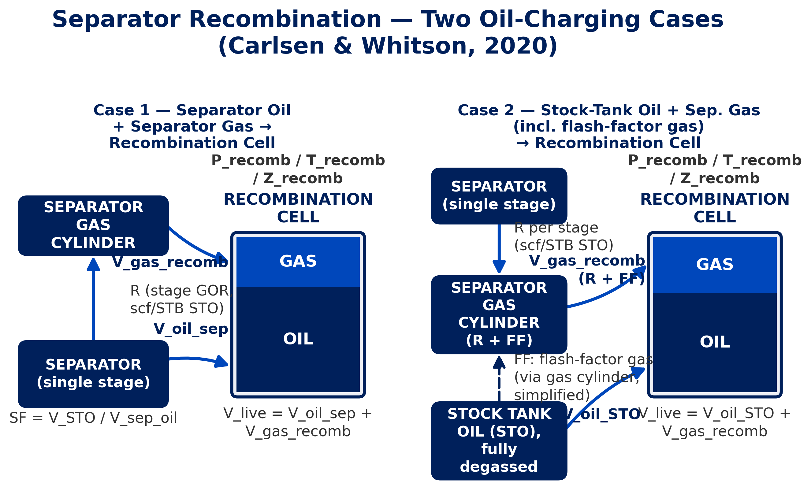

# Chapter 7 - Recombination / Live Oil Preparation

> **In plain terms.** This is the reverse of the flash test (Chapter 6):
> instead of starting from live reservoir oil and letting the gas out,
> you start from the two pieces that flash test left you with - stock-
> tank oil and separator gas - and meter them back together in the
> right proportion to rebuild a live reservoir-oil sample. Get the
> proportion right and the recombined fluid reproduces the reservoir
> fluid's gas-oil ratio, ready to charge into a PVT cell.

Module 1 of the platform. This chapter covers preparing a live (recombined)
fluid sample for PVT cell testing: the two engineering routes the platform
supports, the equations each runs, planning and verifying the cylinder
charge, K-values, an open ruling on GOR-basis direction you should know
about before trusting a Separator-basis molar split, and the QC/report each
route produces. Equations are transcribed from
`pvt/experiments/recombination/calc.py`, `models.py`, `compressibility.py`,
`molar.py`, and `loading.py`. Worked numbers are the SA-372 sample from
`tests/golden/test_molar_recombination_sa372.py` and
`tests/golden/test_loading_sa372.py`, cached from
`ADRIC_LiveOil_Preparation_Calc_v4.1.xlsx`.

## 7.1 Purpose

{width=100%}

A live-oil PVT cell needs to be charged with a fluid that reproduces the
reservoir fluid's gas-oil ratio - separator oil and separator gas (or
stock-tank oil and recombination gas) metered together in the right
proportion to hit a target GOR. Recombination is the calculation (and
verification) that gets that proportion right before - and after - you
charge the cylinder.

## 7.2 Two routes, and when to use each

### 7.2.1 Volumetric SF/FF (Carlsen & Whitson)

This is the platform's **Volumetric (SF/FF)** tab, implemented by
`calculate_multistage`. Its module docstring states the nomenclature and
governing relation directly:

> Nomenclature follows Carlsen & Whitson (IPTC-19775, 2020) and the Whitson
> manual. Total producing GOR:
> $$Rp = Rp_{,sep}/SF + FF \tag{7.1}$$
> where $Rp_{,sep}$ is GOR at separator in scf per STB separator oil
> (metered), $SF$ is the Separator-Oil Shrinkage Factor
> $= V_{STO}/V_{sep,oil}$, $FF$ is the Flash Factor (scf flash gas per STB
> STO - the solution GOR of the separator oil), and $Rp$ is the total
> producing GOR in scf per STB STO.

Use this route when you have **measured separator-stage GOR(s)** and a
**shrinkage factor**, and you're charging either the separator oil itself
(Case 1) or the stock-tank oil directly (Case 2).

**Important convention note**, from the same docstring: in this engine, the
per-stage GOR input (`SeparatorStage.R`) is already shrinkage-corrected -
i.e. it *is* $Rp_{,sep}/SF$, not the raw metered separator-basis GOR. So the
code's actual sum is:

$$Rp_{total,cc} = \sum_{stages} R_{stage,cc} + FF_{cc} \quad \text{[cc gas std / cc STO]} \tag{7.2}$$

**Case 1 - `oil_source="separator"`**: separator oil is charged; $SF$
converts $V_{sep,oil} \to V_{STO}$ for the gas-volume calculation; no flash
gas ($FF=0$).

**Case 2 - `oil_source="stock_tank"`**: stock-tank oil (fully degassed) is
charged; $FF$ is the additional stock-tank flash gas (solution GOR of the
separator oil). By lab-practice simplification, **all** gas - separator
stages plus flash - is loaded from the separator gas cylinder.

The recombination-gas conversion factor, cc of gas at recombination
conditions per cc of gas at standard conditions:

$$factor_{recomb} = \frac{P_{std}}{P_{recomb}} \times \frac{T_{recomb,R}}{T_{std,R}} \times Z_{recomb} \tag{7.3}$$

The oil-volume conversion factor is case-dependent:

$$Bo_{sep,eff} = \begin{cases} 1/SF & \text{Case 1} \\ 1.0 & \text{Case 2} \end{cases} \tag{7.4}$$

Cylinder mix ratio - cc gas at recombination conditions per cc oil charged:

$$CMR = \frac{Rp_{total,cc} \times factor_{recomb}}{Bo_{sep,eff}} \tag{7.5}$$

The oil volume is **live-fluid-volume driven** - this guarantees exact
volume balance ($V_{oil,sep} + V_{gas,total,recomb} = V_{live}$ exactly):

$$V_{oil,sep} = \frac{V_{live}}{1 + CMR} \tag{7.6}$$

$$V_{oil,STO} = \begin{cases} V_{oil,sep} \times SF & \text{Case 1} \\ V_{oil,sep} & \text{Case 2 (already STO)} \end{cases} \tag{7.7}$$

**Charging-pressure compressibility correction** - oil volume at the
pressure it is actually charged into the cylinder at ($p_{charge}$, default
14.7 psia), vs. the volume at recombination pressure:

$$V_{oil,charge} = V_{oil,sep} \times \exp\!\big(c_o \times (P_{recomb} - p_{charge})\big) \tag{7.8}$$

`c_o` (oil isothermal compressibility, 1/psia) is supplied by
`effective_c_o` in `pvt.experiments.recombination.compressibility`, either
as a single constant value, or evaluated from a polynomial at the
reference (charging) pressure:

$$c_o(P) = a_0 + a_1 P + a_2 P^2 + a_3 P^3 + \dots \tag{7.9}$$

Field units only (1/psia basis) - a caller collecting SI-unit coefficients
must convert them (multiply the $n$-th coefficient by $14.5038^{n+1}$) and
convert $p_{ref}$ to psia *before* calling `effective_c_o`.

Per separator stage, the gas volumes at standard, separator, and
recombination conditions:

$$V_{gas,std} = R_{stage,cc} \times V_{oil,STO} \tag{7.10}$$

$$V_{gas,sep} = V_{gas,std} \times \frac{P_{std}}{P_{stage}} \times \frac{T_{stage,R}}{T_{std,R}} \times Z_{stage} \tag{7.11}$$

$$V_{gas,recomb} = V_{gas,std} \times factor_{recomb} \tag{7.12}$$

Case 2's flash gas gets the same std → recomb conversion, and is folded
into the same totals as the separator-stage gas. No SA-372-specific golden
test exists for this route (the SA-372 fixtures below are the Molar route);
`cli.py recombine` (Section 7.7) and `tests/test_recombination_calc.py`
exercise it against a generic North-Sea-style example instead - do not
treat those figures as SA-372 numbers.

### 7.2.2 Molar (PV=ZnRT split)

This is the platform's **Molar (composition)** tab, implemented by
`pvt.experiments.recombination.molar.molar_split` and `wellstream`. Use this
route when you have a lab GOR plus stock-tank-oil density/MW and gas MW (or
full GC compositions for both), and you want the recombined-fluid
**composition**, not just volumes - this is the LiveOil v4.1
`Recombination` sheet's own method.

GOR basis conversion (see Section 7.6 for the direction this divides in):

$$GOR_{eff} = \begin{cases} GOR / SF & \text{basis = SEPARATOR} \\ GOR & \text{basis = STOCK\_TANK} \end{cases} \tag{7.13}$$

Converted to cc/cc at standard conditions:

$$GOR_{cc} = GOR_{eff} \times 0.178108 \quad (= C_{scf}/C_{STB}) \tag{7.14}$$

Moles of gas per cc of stock-tank oil - ideal gas, PV = ZnRT solved for $n$
at standard conditions:

$$n_{gas} = \frac{P_{std} \times GOR_{cc}}{Z_{std} \times R \times T_{std}} \tag{7.15}$$

Moles of stock-tank oil per cc of stock-tank oil:

$$n_{oil} = \frac{\rho_{STO}}{MW_{STO}} \tag{7.16}$$

Gas/oil mole fractions of the wellstream:

$$f_{gas} = \frac{n_{gas}}{n_{gas}+n_{oil}} \qquad f_{oil} = \frac{n_{oil}}{n_{gas}+n_{oil}} \tag{7.17}$$

Mass fractions and wellstream MW:

$$MW_{wellstream} = f_{gas} \cdot MW_{gas} + f_{oil} \cdot MW_{STO} \qquad w_{gas} = \frac{f_{gas} \cdot MW_{gas}}{MW_{wellstream}} \qquad w_{oil} = \frac{f_{oil} \cdot MW_{STO}}{MW_{wellstream}} \tag{7.18}$$

Wellstream composition blend - mole-fraction-weighted, on each stream's own
normalized mol% basis:

$$z_i = f_{gas} \cdot y_i + f_{oil} \cdot x_i \tag{7.19}$$

### Worked example - SA-372 molar split

Inputs (`tests/golden/test_molar_recombination_sa372.py`): GOR = 339.0
scf/STB (stock-tank basis), $\rho_{STO}$ = 0.8196 g/cc, $MW_{STO}$ = 187.05
g/mol (C36+ MW overridden to 635.0), $MW_{gas}$ = 26.10 g/mol,
$Z_{std}$ = 0.99.

| Eq. | Quantity | Value | Unit | Workbook cell |
|---|---|---|---|---|
| (7.14) | $GOR_{cc}$ | 60.378 | cc/cc | B25 |
| (7.15) | $n_{gas}$ | 0.00258036 | mol/cc STO | B26 |
| (7.16) | $n_{oil}$ | 0.00438162 | mol/cc STO | B27 |
| (7.17) | $f_{gas}$ | 0.370636 | - | B29 |
| (7.18) | $w_{gas}$ | 0.075937 | - | B31 |
| (7.18) | $MW_{wellstream}$ | 127.40 | g/mol | B33 |

Wellstream composition, eq. (7.19), golden-asserted spot values
(`test_golden_wellstream_composition`):

$$z_{C1} = 23.17\% \qquad z_{C36+} = 2.97\% \qquad \textstyle\sum_i z_i = 100.0\%$$

A few more codes computed by the same function/inputs, for illustration
(not independently golden-pinned, but produced by the exact engine call
above): C2 ≈ 5.37%, C3 ≈ 4.74%, C7 ≈ 3.93%, C10 ≈ 3.81%, C20 ≈ 1.04%. The
full table (all components carried by both the STO and gas streams) is
what the app's Wellstream Composition table and the report both show, in
Katz-Firoozabadi slot order (light ends first, matching the lab GC report
layout).

## 7.3 Cylinder loading

`pvt.experiments.recombination.loading.plan_loading` takes a target
stock-tank-oil charge volume and the molar split (7.2.2) and works out how
much recombination gas, by volume at gas-cylinder load conditions, must be
charged alongside it to hit the split's GOR - plus whether the combined
charge fits the transfer cylinder.

Stock-tank-equivalent volume of the oil charge, correcting the load-density
oil volume to a 60°F-density-equivalent volume:

$$V_{STO,equiv} = V_{oil,charge} \times \frac{\rho_{STO,load}}{\rho_{STO,60°F}} \tag{7.20}$$

Moles of oil charged and moles of gas required to hit the split's GOR:

$$n_{oil} = \frac{V_{STO,equiv} \times \rho_{STO,60°F}}{MW_{STO}} \qquad n_{gas} = split.n_{gas/cc,STO} \times V_{STO,equiv} \tag{7.21, 7.22}$$

$n_{gas}$ expressed as a standard-conditions gas volume:

$$V_{gas,std} = n_{gas} \times Z_{std} \times R \times \frac{T_{std}}{P_{std}} \tag{7.23}$$

**The 14.73 psig → psia lab convention.** Gas-cylinder load pressure is
converted gauge → absolute using the *lab volumetric standard*, not the
atmosphere/gas-constant standard used everywhere else psig → psia
conversions happen in this codebase:

$$P_{load,psia} = P_{load,psig} + 14.73 \tag{7.24}$$

The `loading.py` module docstring is explicit about why this matters:

> This is deliberate - the Loading_Volumes sheet's B16/B17 gauge→absolute
> formulas add the lab volumetric standard (14.73 psia), **not**
> `psig + 14.696` (`constants.P_ATM_PSIA`) used elsewhere for psig→psia
> conversions.

Real-gas conversion factor, standard cc per cc at gas-load conditions, and
the resulting gas charge volume:

$$factor_{load} = \frac{P_{load} \times Z_{std} \times T_{std}}{Z_{load} \times T_{load} \times P_{std}} \qquad V_{gas,charge} = \frac{V_{gas,std}}{factor_{load}} \tag{7.25, 7.26}$$

**Fits check** - total charge must be ≤ 95% of cylinder volume (headspace
reserve for thermal expansion during recombination):

$$total_{charge} = V_{oil,charge} + V_{gas,charge} \qquad fits = total_{charge} \le 0.95 \times V_{cylinder} \tag{7.27}$$

### Worked example - SA-372 loading plan

Inputs (`tests/golden/test_loading_sa372.py`): cylinder 1000 cc, target oil
charge 150 cc, oil load 2000 psig / 75°F, gas load 5000 psig / 75°F /
$Z=0.85$, $\rho_{STO,load}$ = 0.885 g/cc, against the 7.2.2 split above.

| Eq. | Quantity | Value | Unit | Workbook cell |
|---|---|---|---|---|
| - | $V_{oil,charge}$ | 150.0 | cc | B22 |
| (7.20) | $V_{STO,equiv}$ | 161.97 | cc | B23 |
| (7.21) | $n_{oil}$ | 0.709687 | mol | B25 |
| (7.22) | $n_{gas}$ | 0.417938 | mol | B29 |
| (7.23) | $V_{gas,std}$ | 9779.46 | cc | B30 |
| (7.25) | $factor_{load}$ | 385.39 | std cc/cc | B31 |
| (7.26) | $V_{gas,charge}$ | 25.38 | cc | B32 |
| (7.27) | `fits` / utilization | True / 17.5% | - | - |

## 7.4 Actual-GOR verification

`verify_actual_gor` runs the same real-gas bookkeeping in reverse: given the
oil and gas volumes **actually metered** into the cylinder, it recovers the
as-loaded GOR and grades its deviation from the target GOR.

$$n_{actual} = \frac{V_{gas,actual} \times P_{load}}{Z_{load} \times R \times T_{load}} \tag{7.28}$$

$$V_{std} = n_{actual} \times Z_{std} \times R \times \frac{T_{std}}{P_{std}} \tag{7.29}$$

$$V_{STO,actual} = V_{oil,actual} \times \frac{\rho_{STO,load}}{\rho_{STO,60°F}} \tag{7.30}$$

$$GOR_{actual} = \frac{V_{std}}{V_{STO,actual}} \times \frac{C_{STB}}{C_{scf}} \quad [\text{scf/STB}] \tag{7.31}$$

$$deviation\% = \frac{GOR_{actual} - GOR_{target}}{GOR_{target}} \times 100 \tag{7.32}$$

**QC gate**: `gor_actual_vs_target_pct`, review at >5%, fail at >10% of
absolute deviation.

### Worked example - SA-372, actual charge vs. plan

The plan (Section 7.3) called for charging **150 cc oil and 25.38 cc gas**.
The technician's actually-metered charge came in different:
**108.96 cc oil, 27.47 cc gas** (`tests/golden/test_loading_sa372.py::test_golden_actual_gor_fails_gate`):

| Eq. | Quantity | Value |
|---|---|---|
| (7.31) | $GOR_{actual}$ | 505.2 scf/STB (B47) |
| (7.32) | $deviation\%$ | +49.03% (B49) |
| gate | Severity | **FAIL** (>10%, B50) |

This is the platform doing exactly the job it should: the actual charge
undershot the planned oil volume and overshot the gas, and the back-
calculated GOR flags it clearly rather than letting a mis-charged cylinder
go to the PVT cell unnoticed.

## 7.5 K-values

`pvt.experiments.recombination.molar.k_values` computes equilibrium K-values
from any gas/liquid stream pair, on each stream's normalized mol% basis:

$$K_i = \frac{y_i}{x_i} \quad \text{for every } i \text{ with } x_i > 0 \tag{7.33}$$

A component present only in the gas stream ($x_i$ absent/zero) is **omitted**
- K would be undefined/infinite. A component present in the liquid but
absent from the gas is **included** with $K_i = 0.0$ (its $y_i$ is treated
as 0, and $x_i > 0$ still qualifies it). From the module's own unit test
(`tests/unit/experiments/test_molar_recombination.py`): gas {C1: 80%,
C2: 20%}, liquid {C2: 50%, C7: 50%} gives $K_{C2} = 0.4$, $K_{C7} = 0.0$, and
C1 is excluded entirely.

This is the same y/x concept the Hoffman-Crump crossplot (Chapter 6, eq.
6.25) builds on for a flash gas/liquid pair. As of this writing, `k_values`
is an engine-level utility - it is **not yet wired into the Recombination
page or the report tables**; use it directly (Python/CLI script) against
your gas and STO/liquid `CompositionStream`s if you need a K-value table for
a recombination pair.

## 7.6 The D-018 open ruling - GOR basis direction

There is an unresolved discrepancy between the LiveOil v4.1 workbook and
this engine's `GorBasis` convention, tracked as **D-018** in
`docs/excel-deviations.md`, status `proposed - NEEDS SWEJ RULING`. Both
readings, stated honestly:

**What the workbook does.** `LiveOil v4.1 Recombination!B8` is
`=IF(B6="Stock Tank", B5/B7, B5)` - it divides the GOR by the shrinkage
factor **on the Stock Tank branch**, and uses the raw GOR as-is on the
Separator branch.

**What the engine does.** Eq. (7.13) above divides on the **opposite**
branch: `GorBasis.SEPARATOR` divides by shrinkage (the conventional
direction - a separator-metered GOR in scf per separator barrel is
converted to a stock-tank basis by dividing by $SF = V_{STO}/V_{sep,oil}$);
`GorBasis.STOCK_TANK` is used as-is, since it is already on a stock-tank
basis.

The engine's `molar.py` module docstring calls this out explicitly at the
point of decision:

> D-018: conventional direction - separator-basis GOR (scf/sep-bbl) is
> divided by shrinkage to convert to a stock-tank (scf/STB) basis;
> stock-tank-basis GOR is already on that basis and used as-is. LiveOil
> v4.1 Recombination!B8 implements the reverse (divides on the STOCK_TANK
> branch instead).

**Why the SA-372 goldens in this chapter are unaffected either way.** The
SA-372 fixture's shrinkage factor is $SF = 1.0$
(`tests/fixtures/sa372.py`, workbook `Recombination!B7`). Dividing 339.0 by
1.0 gives 339.0 regardless of which basis branch does the dividing - the
two conventions are numerically identical at $SF=1.0$ and only diverge once
$SF \ne 1$. `test_separator_basis_direction()` demonstrates this directly
with a non-unity shrinkage (0.8): `GorBasis.SEPARATOR` gives
$339.0/0.8 = 423.75$ while `GorBasis.STOCK_TANK` gives $339.0$ - a real,
material difference once shrinkage departs from 1.0.

**What this means for you.** If you import a LiveOil v4.1 workbook whose
`Recombination!B6` is set to "Separator" and whose shrinkage factor is not
1.0, this platform's molar split will **not** match that workbook's own B8
cell - by design, pending Swej's ruling on which direction is actually
correct. Until that ruling lands, treat a Separator-basis GOR with
$SF \ne 1$ as a case to sanity-check by hand.

## 7.7 QC and report

**Molar route.** When compositions are available (workbook upload only -
manual entry collects no GC composition), `composition_normalization.check`
runs on the STO and gas streams' mol% bases (same eq. 6.23 as Chapter 6).
`mw_consistency` is **not** run here: the LiveOil v4.1 importer only reads
the Mol% (INPUT) column (col I) - Wt% (INPUT) is never consumed - so these
streams never carry a wt% basis to check consistency against. The
Actual-GOR verification (7.4) contributes its own `gor_actual_vs_target_pct`
QCResult once you submit actual charge volumes.

**Volumetric SF/FF route.** No QC checks are currently wired into this tab
- there is no composition data in this flow to check. The self-consistency
signal it does offer is `GOR_check`, a back-calculation of the total GOR
from all gas actually placed in the cell (separator-stage + flash), shown
alongside the input total; `cli.py recombine` prints the deviation between
the two directly (flagged with a warning glyph past 0.1%), but it is not
graded through `ThresholdRegistry` the way the checks above are.

**Report contents.**

- Molar route: `pvt.reporting.tables.recombination_tables` - **Molar
  Split** (9 rows, Section 7.2.2's outputs), **Loading Plan** (10 rows,
  Section 7.3's outputs plus fits/utilization), **QC Summary** (one row per
  QCResult run, including the Actual-GOR pill once verified).
- Volumetric route: built directly from `MultiStageResults` fields - **Setup**
  (live fluid volume, oil source/Case, SF, FF), **Recombination Conditions**
  (P/T/Z/factor_recomb), **Charge Volumes** (separator oil, charging-pressure
  oil, STO-equivalent, total gas at std/recomb, cylinder mix ratio), **GOR
  Verification** (input vs. back-calculated), **Stage GORs** (per stage).
  This route has no QC Summary table (nothing is graded here yet).

**CLI.** `cli.py recombine` runs the Volumetric SF/FF route from typed
flags (stages, pressures, temperatures, Z-factors, SF/FF, recombination
conditions, units field/SI, plus an optional Standing bubble-point
estimate) and prints a fixed-width report. There is currently **no CLI
subcommand for the Molar/LiveOil-workbook route** - unlike Chapter 6's
`cli.py flash`, there is no `cli.py recombine-molar` (or similar) that
imports a filled `ADRIC_LiveOil_Preparation_Calc_v4.1.xlsx` and prints its
molar-split/loading-plan report; that route is currently app-only (or
direct Python calls to `pvt.io.excel_import.liveoil_v41.read` +
`molar_split` + `plan_loading`).
